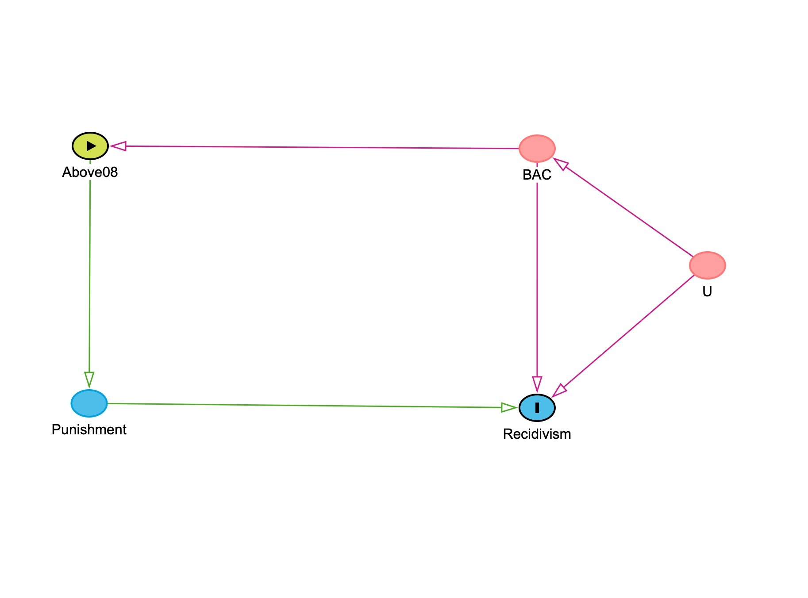

1.  **Introduction**

    Drunk driving continues to impose substantial social and economic costs, and legal sanctions are intended to deter repeat offenses. Yet it is difficult to determine whether harsher punishment actually reduces recidivism because drivers who receive more severe penalties often differ systematically from those who receive lighter ones. This paper examines whether crossing the legal blood alcohol concentration (BAC) threshold of 0.08, which triggers stricter DUI penalties, affects the probability that a driver commits another drunk-driving offense. We exploit the fact that the 0.08 rule creates a sharp policy cutoff: drivers just below and just above the threshold should be similar in underlying characteristics, but those above the cutoff face harsher legal consequences. Using a regression discontinuity design, we compare drivers near this threshold to estimate the local causal effect of the policy. By focusing on observations close to the cutoff, the analysis treats the legal threshold as a natural experiment that helps isolate the deterrent impact of stricter DUI punishment on future recidivism.

2.  **Background and policy context.**

    In Washington State, the legal DUI threshold for adults has been BAC 0.08 since January 1, 1999. Drivers at or above that cutoff face a DUI charge and substantially harsher statutory sanctions than drivers just below it, including higher minimum fines, mandatory jail time or home monitoring, license suspension, and insurance requirements. For a first offense, the statutory minimum penalty rises from \$865.50 with 24 hours minimum jail and a 90-day license suspension at BAC 0.08–0.15, with sanctions structured to escalate further for repeat offenders. Because punishment changes discretely at 0.08 while drivers very near the cutoff should otherwise be similar, crossing that threshold creates the policy discontinuity that makes the regression discontinuity design plausible in this setting.

3.  **Data**

    We use the DWI_Data.rdata subset of Hansen’s Washington State impaired-driving data, which contains 214,558 traffic stops in our working sample and is designed to study whether harsher punishment affects later recidivism. The key variables are the two BAC measures, `bac1` and `bac2`, the outcome `recidivism`, and predetermined covariates including `male`, `white`, `aged`, `acc`, and `year`. Each driver receives two BAC tests, so to construct a single running variable for the RD design we use `bac_min = pmin(bac1, bac2)`. This gives one BAC value per stop, avoids treating the same incident as two observations, and uses a conservative classification rule when determining whether a driver falls above or below the 0.08 legal threshold. In the sample, all key analysis variables have zero missingness, so no additional exclusions are required.

4.  **Exploratory Data Analysis**

    Our exploratory analysis prepares the dataset for the regression discontinuity design and provides an initial understanding of the variables used in the study. First, we construct the running variable by taking the minimum of the two BAC tests (bac_min). Next, we examine the distribution of BAC values and the density of observations near the 0.08 legal threshold to ensure sufficient data around the cutoff. We also compute the baseline recidivism rate to provide context for later estimates. These steps help verify data quality and confirm that the dataset contains enough observations near the policy threshold for a credible RD analysis.

```{r}
#| message: false
#| warning: false

library(tidyverse)
library(fixest)
```

```{r}
load("data/DWI_data.rdata")
ls()
```

```{r}
# Data checks for variable accuracy
#| label: inspect-and-check
#| message: false
#| warning: false

# structure check
glimpse(dwi)

# variables check
required_vars <- c("bac1", "bac2", "recidivism", "male", "white", "aged", "acc")
missing_vars <- setdiff(required_vars, names(dwi))

if (length(missing_vars) > 0) {
  stop("Missing required variables: ", paste(missing_vars, collapse = ", "))
} else {
  cat("All required variables are present.\n")
}
```

#### 4.1. Key RDD variables (running variable and cutoffs)

According to the dataset, each driver has two BAC tests, `bac1` and `bac2`. To create one running variable for the RDD, we use the minimum of the two tests (`bac_min`) because the minimum BAC reading is the measure that determines guilt relative to the legal threshold in the original Hansen setting, and using it provides a conservative classification rule that avoids assigning drivers above 0.08 based on small measurement differences between the two tests. As a result, `bac_min` is the running variable most closely aligned with the policy rule that generates harsher punishment.

```{r}
#| label: create-rdd-vars
#| message: false
#| warning: false

dwi <- dwi %>%
  mutate(
    bac_min = pmin(bac1, bac2, na.rm = TRUE),
    above_08 = as.integer(bac_min >= 0.08),
    bac_centered_08 = bac_min - 0.08
  )

# Sanity checks
summary(dwi$bac_min)
table(dwi$above_08, useNA = "ifany")
summary(dwi$bac_centered_08)
```

#### 4.2. Initial exploration (BAC distribution and baseline recidivism)

We begin with basic exploration to understand- (i) the distribution of the running variable (`bac_min`), (ii) how much data lies near the 0.08 policy cutoff, (iii) the overall baseline recidivism rate.

```{r}
#| label: bac-distribution-overall
#| message: false
#| warning: false

ggplot(dwi, aes(x = bac_min)) +
  geom_density(fill = "skyblue", alpha = 0.45, linewidth = 1) +
  geom_vline(xintercept = 0.08, linewidth = 1.1, linetype = "dashed", colour = "firebrick3") +
  coord_cartesian(xlim = c(0, 0.30)) +
  labs(
    title = "BAC distribution (minimum of two tests)",
    subtitle = "Dashed lines mark policy thresholds at 0.08",
    x = "BAC (bac_min)",
    y = "Density"
  ) +
  theme_minimal(base_size = 12) +
  theme(plot.title = element_text(face = "bold"))
```

#### 4.3. BAC distribution near the 0.08 cutoff

To check for unusual “bunching” right at the legal threshold, we zoom in on a narrow window around BAC = 0.08.

```{r}
#| label: bac-zoom-008
#| message: false
#| warning: false

dwi_008 <- dwi %>% 
  filter(bac_min >= 0.03, bac_min <= 0.13)

ggplot(dwi_008, aes(x = bac_min)) +
  geom_density(fill = "deepskyblue3", alpha = 0.45, linewidth = 1) +
  geom_vline(xintercept = 0.08, linewidth = 1.2, linetype = "dashed", colour = "firebrick3") +
  labs(
    title = "BAC distribution near the 0.08 cutoff",
    subtitle = "Density plot for bac_min in [0.03, 0.13]; dashed red line at 0.08",
    x = "BAC (bac_min)",
    y = "Density"
  ) +
  theme_minimal(base_size = 12) +
  theme(plot.title = element_text(face = "bold"))
```

```{r}

```

#### 4.4. Baseline recidivism rate

As a reference point, we compute the overall recidivism rate in the full sample.

```{r}
#| label: baseline-recidivism
#| message: false
#| warning: false

dwi %>%
  summarise(
    n = n(),
    recidivism_rate = mean(recidivism, na.rm = TRUE)
  )
```

#### 4.5. Missingness check

Before making any data-cleaning decisions, we report how much 'missingness' exists in the key analysis variables.

```{r}
#| label: missingness-check
#| message: false
#| warning: false

key_vars <- c("bac1", "bac2", "bac_min", "recidivism", "male", "white", "aged", "acc", "year")

dwi %>%
  summarise(across(all_of(key_vars), ~ mean(is.na(.)))) %>%
  pivot_longer(everything(), names_to = "variable", values_to = "missing_share") %>%
  arrange(desc(missing_share))
```

#### 4.6. Quick near-cutoff comparison

As an initial descriptive check, we compare observations just below vs just above each cutoff within a narrow window (±0.02 BAC). This is not the final regression discontinuity estimate, but it provides an early sense of whether outcomes and co-variates look similar near the threshold.

```{r}
#| label: near-cutoff-summary
#| message: false
#| warning: false

w <- 0.02  # window size (±0.02)

summary_near <- function(cutoff) {
  dwi %>%
    filter(bac_min >= cutoff - w, bac_min <= cutoff + w) %>%
    mutate(above = as.integer(bac_min >= cutoff)) %>%
    group_by(above) %>%
    summarise(
      n = n(),
      recid_rate = mean(recidivism),
      male_share = mean(male),
      white_share = mean(white),
      mean_age = mean(aged),
      acc_share = mean(acc),
      .groups = "drop"
    ) %>%
    mutate(cutoff = cutoff) %>%
    relocate(cutoff, above)
}

bind_rows(
  summary_near(0.08),
) %>%
  arrange(cutoff, above)
```

At 0.08, recidivism is lower just above the cutoff (≈ 0.0989) than just below (≈ 0.1147).

#### 4.7. Interim takeaways from initial exploration

At this stage, we have, (i) created the running variable for the regression discontinuity design (`bac_min`, defined as the minimum of the two BAC tests), (ii) checked basic data quality.

The distribution of `bac_min` looks smooth overall and around the policy cutoff (0.08) based on the density plots. Missingness is effectively zero in the key variables used in later analysis, so no sample exclusions are required for missing data.

As an initial descriptive comparison within ±0.02 of each cutoff, recidivism appears lower just above 0.08 than just below. These comparisons are descriptive and do not yet isolate the causal effect; they mainly motivate the formal RDD analysis in the next stage.

#### 4.8. Difference summary table

```{r}
#| label: near-cutoff-differences
#| message: false
#| warning: false

near_tbl <- bind_rows(
  summary_near(0.08),
)

near_tbl %>%
  group_by(cutoff) %>%
  summarise(
    diff_recid = recid_rate[above == 1] - recid_rate[above == 0],
    diff_male  = male_share[above == 1] - male_share[above == 0],
    diff_white = white_share[above == 1] - white_share[above == 0],
    diff_age   = mean_age[above == 1] - mean_age[above == 0],
    diff_acc   = acc_share[above == 1] - acc_share[above == 0],
    .groups = "drop"
  )
```

## **5. DAG: Visualizing the causal relationship**

{width="734"}

Figure presents the causal logic behind our regression discontinuity design. BAC is the running variable, and the node BAC ≥ 0.08 represents the legal assignment rule that determines whether a driver is exposed to harsher DUI punishment. That punishment is the treatment mechanism through which crossing the threshold may affect future recidivism. The diagram also includes U, which captures unobserved driver characteristics, such as alcohol misuse or alcoholism, impulsiveness, or risk tolerance, that may influence both BAC and the likelihood of reoffending. These unobserved factors create a backdoor path that would bias a simple comparison of drivers with higher and lower BAC levels. By focusing on drivers just below and just above the 0.08 cutoff, the RD design uses the policy cutoff to isolate the local causal effect of harsher punishment on recidivism.

## 5.1. Causal Logic

Building on the causal structure shown in Figure 6, the key empirical challenge is to isolate the effect of harsher DUI punishment from the characteristics of the drivers who receive it. Drivers with higher BAC levels are more likely to face tougher penalties, but they may also differ in less visible ways, such as impulsiveness, alcohol misuse, or a greater willingness to take risks, that independently increase the likelihood of reoffending. For that reason, a simple comparison between drivers with lower and higher BAC levels would confound the effect of punishment with the effect of those underlying differences.

The 0.08 BAC cutoff helps address this problem. Because Washington State’s DUI penalties increase sharply at that threshold, drivers just below and just above 0.08 should be very similar, while only those above the cutoff receive harsher punishment. This is what makes the setting well suited to a regression discontinuity design: by comparing drivers very close to the threshold, we can use the policy rule as a natural experiment to estimate the local effect of harsher punishment on future recidivism. In the next step, we will be assess whether the assumptions required for that design are supported by the data.

## 6. Identification Assumptions and Supporting Checks

## i. Checking Data for Lumping

Now that the data are prepared and the causal logic is clear, the next step is to test whether the key assumptions of the regression discontinuity design are plausible in this setting. Before estimating the treatment effect at the 0.08 BAC cutoff, we need to check that drivers are not systematically sorting to one side of the threshold or the other. We assess this by examining the distribution of the running variable near the cutoff with a lumping test. We also need to verify that drivers just below and just above 0.08 look similar on predetermined characteristics. We assess that by estimating placebo regressions using variables that should not jump at the threshold.

A useful first check is whether there is any manipulation in the running variable around 0.08. To examine this, we graph the BAC distribution using bins and look for any unusual break or bunching in the number of observations right at the cutoff.

```{r}
#Check lumping at the 0.08 cutoff
dwi_bin_count <- dwi %>%
  filter(bac_min >= 0.03, bac_min <= 0.13) %>%
  mutate(bac_bins = cut(bac_min, breaks = 3:13/100)) %>%
  group_by(bac_bins) %>%
  count()

#Create plot to visualize the data
ggplot(dwi_bin_count, aes(x = bac_bins, y = n)) +
  geom_col() +
  geom_vline(xintercept = 5.5,
             color = "red", linetype = "dashed") +
  labs(title = "Observation counts near 0.08 BAC cutoff",
       x = "BAC bin", y = "Count") +
  theme_minimal() +
  theme(axis.text.x = element_text(angle = 45, hjust = 1))
```

```         
```

We use this visual check is used to assess whether there is manipulation of the running variable, a key assumption for a valid regression discontinuity design. If drivers or law enforcement were systematically influencing BAC readings to fall on one side of the threshold, we would expect to observe a sharp spike or drop in the number of observations immediately below or above the cutoff. Instead, the distribution appears smooth, with no noticeable bunching just below 0.08. This suggests that drivers are not sorting around the threshold and that BAC readings near the cutoff are plausibly random. Because the distribution remains continuous at the threshold, the identifying assumption of the RD design appears reasonable, allowing us to proceed with placebo

## 6.ii. The Placebo Tests

Our placebo tests evaluate whether the observations just below and just above the 0.08 BAC cutoff are truly comparable. We run these tests because a valid regression discontinuity design requires that the cutoff changes only the treatment intensity, in this case, harsher punishment, and not other underlying characteristics of the drivers. To check this, we re-estimate the RD specification using predetermined variables such as male, white, aged, and acc as outcomes instead of recidivism. If the design is credible, we should not observe a discontinuous jump at the cutoff for any of these variables. A significant jump would suggest that drivers on either side of 0.08 differ in ways other than punishment, which would weaken the validity of the comparison. Because our analysis focuses on the instructor-approved 0.08 threshold, we perform these placebo checks only at that cutoff.

```{r}
#Create centered variable for BAC at 0.08 cutoff
dwi <- dwi %>%
  mutate(bac_centered_08 = bac_min - 0.08)

# Run placebo regressions at the 0.08 cutoff
p1 <- feols(male  ~ above_08 * bac_centered_08,
            data = dwi %>% filter(abs(bac_centered_08) < 0.05),
            vcov = "hetero")

p2 <- feols(white ~ above_08 * bac_centered_08,
            data = dwi %>% filter(abs(bac_centered_08) < 0.05),
            vcov = "hetero")

p3 <- feols(aged  ~ above_08 * bac_centered_08,
            data = dwi %>% filter(abs(bac_centered_08) < 0.05),
            vcov = "hetero")

p4 <- feols(acc   ~ above_08 * bac_centered_08,
            data = dwi %>% filter(abs(bac_centered_08) < 0.05),
            vcov = "hetero")

etable(p1, p2, p3, p4)
```

The placebo regression results provide a useful check on whether drivers just below and just above the 0.08 BAC cutoff are comparable. In these models, we replace recidivism with predetermined characteristics, sex, race, age, and accident involvement, and estimate the same regression discontinuity specification used in the main analysis. The coefficient of interest is the indicator for being above the cutoff, since it captures any discrete jump at the threshold. Across these regressions, that coefficient is small and statistically insignificant in every case, suggesting that these observable characteristics do not change abruptly at 0.08. This pattern is consistent with the idea that drivers on either side of the legal threshold are similar in observable ways, which supports the credibility of the regression discontinuity design. We report heteroskedasticity-robust standard errors in the placebo regressions for consistency with the main analysis and because the variance of the error term may differ across observations.

```{r}

```

## 7. Regression Discontinuity Specification

7.  **i. The working equation**

$$
\text{Recidivism}_i = \beta_0 + \beta_1 \text{Above08}_i + \beta_2 (BAC_i - 0.08) + \beta_3 \big[\text{Above08}_i \times (BAC_i - 0.08)\big] + \varepsilon_i
$$

To estimate the effect of harsher punishment at the legal threshold, we use a local linear regression discontinuity specification centered at BAC = 0.08. In this model, `Above08` indicates whether a driver falls at or above the legal cutoff, while the centered BAC term measures distance from the threshold. The interaction term allows the relationship between BAC and recidivism to differ on either side of the cutoff. The coefficient of primary interest is B1​, which captures the discontinuous jump in recidivism at **0.08** and represents the local effect of crossing the legal BAC limit.

## 8. Main Regression Discontinuity Models

Now that we have checked the key assumptions in our data set, we proceed with the main analysis. We want to determine whether crossing the BAC threshold, and receiving a harsh punishment, causes a decrease in recidivism. Firstly, we center the running variable around each cutoff point, creating a treatment indicator for being above the threshold and then interact these two variables. The coefficient on the treatment indicator shows the jump in recidivism at the cutoff, which is our estimate of the effect of a harsher punishment. We then run three different variations for each cutoff: 1) a wider window of 0.05, 2) a narrower window of 0.02, and 3) a wide window with our additional variables added as controls. We then compare the results among these three variations to see if our results are stable.

7.  **i. Main RD Estimate at the 0.08 BAC Cutoff (±0.05 Window)**

```{r}

r1 <- feols(
  recidivism ~ above_08 * bac_centered_08,
  data = dwi %>% filter(abs(bac_centered_08) < 0.05),
  vcov = "hetero"
)

etable(r1)

```

Regression table 1.

We estimate a local linear regression discontinuity model within a ±0.05 window around the 0.08 BAC cutoff to compare drivers who are closest to the legal threshold. This choice is justified because RD relies on local comparisons, where observations just below and just above the cutoff are most plausibly similar except for the harsher punishment triggered at 0.08. The interaction between above_08 and bac_centered_08 allows the BAC–recidivism relationship to differ on either side of the threshold while identifying the jump at the cutoff. The coefficient on above_08 is -0.0188 and statistically significant, indicating that drivers just above 0.08 have an estimated recidivism rate about 1.9 percentage points lower than comparable drivers just below the cutoff.

7.  **ii. Robustness Check: Narrower Bandwidth (±0.02)**

```{r}
r2 <- feols(recidivism ~ above_08 * bac_centered_08,
            data = dwi %>% filter(abs(bac_centered_08) < 0.02), vcov ="hetero")
etable(r2)
```

We use a bandwidth of ±0.02 around the 0.08 cutoff, meaning the estimation sample includes drivers with BAC values between 0.06 and 0.10. This narrower specification serves as a robustness check by focusing on observations even closer to the threshold, where drivers just below and just above 0.08 are most plausibly comparable. In this model, the coefficient on `above_08` is −0.0133 and remains statistically significant at the 5 percent level. This implies that drivers just above the legal cutoff have an estimated recidivism rate about 1.3 percentage points lower than those just below it, reinforcing the main deterrence result from the wider bandwidth specification.

7.  **iii. Robustness Check: RD Estimate with Demographic Controls**

```{r}
r3 <- feols(recidivism ~ above_08 * bac_centered_08 + male + white + aged,
            data = dwi %>% filter(abs(bac_centered_08) < 0.05), vcov = "hetero")
etable(r3)
```

The above regression adds male, white, and age as controls within the same ±0.05 bandwidth around the 0.08 cutoff. In an RD design, these controls are not needed for identification if the continuity assumption holds, but they are useful as a robustness check because they can improve precision and show whether the estimated jump is sensitive to modest covariate adjustment. The coefficient on `above_08` is -0.0192, nearly identical to the baseline estimate of -0.0188. This stability suggests that the main result is not being driven by observable demographic differences, strengthening the interpretation that crossing 0.08 reduces recidivism locally.

## 8. Results and Interpretation

8.  **i. RD plot of recidivism around 0.08 cutoff.**

```{r}

#| label: rd-plot-recidivism

library(ggplot2)
library(dplyr)

dwi %>%
  filter(abs(bac_centered_08) < 0.05) %>%   # same bandwidth as main regression
  ggplot(aes(x = bac_centered_08, y = recidivism)) +

  # binned means
  stat_summary_bin(
    bins = 30,
    fun = mean,
    geom = "point",
    color = "black"
  ) +

  # fitted line left of cutoff
  geom_smooth(
    data = dwi %>% filter(bac_centered_08 < 0 & abs(bac_centered_08) < 0.05),
    method = "lm",
    se = FALSE,
    color = "steelblue"
  ) +

  # fitted line right of cutoff
  geom_smooth(
    data = dwi %>% filter(bac_centered_08 >= 0 & abs(bac_centered_08) < 0.05),
    method = "lm",
    se = FALSE,
    color = "red"
  ) +

  geom_vline(xintercept = 0, linetype = "dashed") +

  labs(
    title = "Recidivism Around the 0.08 BAC Cutoff",
    x = "BAC centered at 0.08",
    y = "Mean Recidivism Rate"
  ) +

  theme_minimal()
```

*Figure* *9. RD plot of recidivism around 0.08 cutoff.*

Figure 9 presents a binned scatter plot of recidivism rates against BAC centered at the 0.08 legal threshold. Each point represents the mean recidivism rate within a small BAC bin, while the fitted lines show local linear trends on either side of the cutoff. The vertical dashed line marks the legal threshold. The figure shows a visible downward jump in recidivism immediately after the cutoff, indicating that drivers just above 0.08 have lower subsequent recidivism than those just below it. This visual pattern is consistent with the deterrence effect estimated in the regression results.

8.  **ii. Results and Interpretation**

Putting the results together, the evidence consistently points to a deterrent effect at the 0.08 BAC cutoff. Across the main specification, the narrower bandwidth check, and the model with demographic controls, the estimated coefficient on above_08 remains negative and statistically significant. The preferred interpretation is that drivers just above 0.08 have a recidivism rate roughly 1.3 to 1.9 percentage points lower than comparable drivers just below the cutoff. Because this pattern is stable across reasonable specifications, the findings support the conclusion that the harsher DUI punishment triggered at 0.08 reduces future drunk-driving recidivism for drivers near the legal threshold.

## 9. Limitations

While the regression discontinuity design provides credible causal identification near the cutoff, the estimates should be interpreted as local effects. Specifically, the results describe the behavior of drivers whose BAC levels fall very close to the 0.08 threshold and may not generalize to drivers with substantially higher or lower BAC levels. In addition, the policy change captured by the cutoff represents a bundle of sanctions, including fines, license suspension, and potential jail time, making it difficult to isolate which component drives the deterrence effect. Despite these limitations, the smooth density of the running variable and the placebo test results support the credibility of the RD design.

## 10. Conclusion

These findings suggest that legal thresholds in DUI policy can play an important deterrent role. Even relatively small increases in punishment at the legal limit appear to reduce the likelihood of repeat offenses among drivers near the threshold.

```         
```
